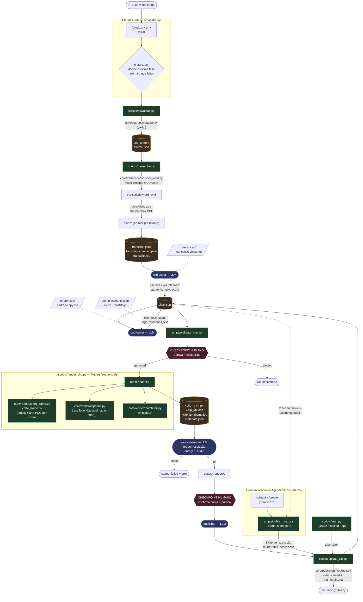
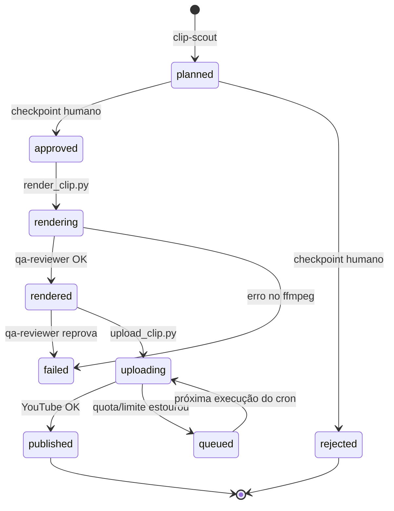

# cut-machine

Pipeline de produção de **cortes virais** (Shorts 9:16 e cortes 16:9) para YouTube, orquestrado
pelo **Claude Code**. Recebe a URL de um vídeo longo, transcreve, deixa a IA escolher os melhores
momentos, escreve título/descrição/tags, renderiza os cortes com moldura de marca e legendas
queimadas, valida tecnicamente e publica — com retomada automática de qualquer etapa interrompida.

> A separação central do projeto: **LLM decide, script executa**. Subagentes (LLM) fazem a análise
> criativa (seleção de momentos, timestamps finos, copy). Scripts Python determinísticos fazem o
> trabalho pesado (download, transcrição, ffmpeg, OAuth, upload). A LLM **nunca** toca em
> tokens/secrets.

---

## Sumário

- [Visão geral](#visão-geral)
- [Arquitetura (fluxograma)](#arquitetura-fluxograma)
- [Fluxo detalhado: da URL à postagem](#fluxo-detalhado-da-url-à-postagem)
- [Máquina de estados](#máquina-de-estados)
- [Módulos](#módulos)
- [Publicação em drip via cron do Windows](#publicação-em-drip-via-cron-do-windows)
- [Comandos](#comandos)
- [Instalação](#instalação)
- [Estrutura de diretórios](#estrutura-de-diretórios)

---

## Visão geral

| Camada | O que é | Onde |
|---|---|---|
| **Orquestrador** | O Claude Code lê o estado, decide a próxima etapa, apresenta checkpoints e retoma. Nunca processa mídia. | [`CLAUDE.md`](CLAUDE.md) |
| **Skills** | Fluxos disparáveis por comando (`/produzir`, `/planejar`, `/renderizar`, `/publicar`, `/status`, `/setup`). | [`.claude/skills/`](.claude/skills/) |
| **Subagentes (LLM)** | Análise criativa: `clip-scout` (momentos), `copywriter` (copy), `qa-reviewer` (validação), `publisher` (upload). | [`.claude/agents/`](.claude/agents/) |
| **Scripts (determinístico)** | CLIs finos e idempotentes sobre o `core`. Cada um imprime **uma linha JSON** no stdout e atualiza o estado sozinho. | [`scripts/`](scripts/) |
| **Core** | Pacote Python: contratos, estado, abstrações de fonte/destino, render (ffmpeg), transcrição (Whisper), diarização. | [`core/`](core/) |
| **Referências** | Rubricas e specs que a LLM consome: heurísticas virais, padrão de copy, formatos, estilo de legenda, API do YouTube. | [`references/`](references/) |

O estado vive em disco: **`video-output/<video_id>/state.json`** (por fase) e
**`clips.json`** (por clip). Antes de qualquer etapa o orquestrador lê o estado — nunca refaz uma
etapa `done`, retoma `partial` só pelo delta.

---

## Arquitetura (fluxograma)

Fluxo completo, desde a URL recebida até a postagem no YouTube — incluindo os módulos do `core`,
os subagentes LLM, os artefatos em disco e o cron do Windows.



**Legenda das cores:** 🟦 subagente LLM · 🟩 script determinístico · 🟧 artefato em disco · 🟥 checkpoint humano.

---

## Fluxo detalhado: da URL à postagem

| # | Fase | Executor | Entrada → Saída |
|---|---|---|---|
| 1 | **download** | `scripts/download.py` → `core/sources/youtube.py` (yt-dlp) | URL → `source.mp4`, `source.json` |
| 2 | **transcribe** | `scripts/transcribe.py` → `core/transcribe/whisper_local.py` (faster-whisper CUDA int8) + `core/diarize.py` (sherpa-onnx) | `source.mp4` → `transcript.json` (+ `.compact`, `.srt`), com falante por palavra |
| 3 | **plan** | subagente **clip-scout** (LLM) | `transcript.compact.json` + `references/heuristicas-virais.md` → clips `planned` em `clips.json` (start/end, hook, score, `thumbnail_ts`) |
| 4 | **copy** | subagente **copywriter** (LLM) | clips `planned` + nicho da conta → `title`, `title_alts`, `description`, `tags`, `thumbnail_text` |
| 5 | **checkpoint** | `scripts/validate_plan.py` + **humano** | valida copy; apresenta tabela; humano aprova/rejeita. Default: sugerir aprovação de `score >= 70` |
| 6 | **render** | `scripts/render_clip.py` (ffmpeg, sequencial) | corta, monta janela + arte PNG por cima, queima legendas (short), gera miniatura → `<clip_id>.mp4`, `.ass`, `.thumb.jpg`, `metadata.json` |
| 7 | **qa** | subagente **qa-reviewer** (LLM orquestrando ffprobe) | valida resolução/duração/áudio → mantém `rendered` ou marca `failed` |
| 8 | **publish** | subagente **publisher** (LLM) → `scripts/upload_clip.py` → `core/publishers/youtube.py` | após aprovação humana + checkpoint de quota → sobe **público**, registra `publish.*` |

**Formatos** (`core/contracts.py` → `FORMAT_RULES`):

- **short** — 30–165 s de conteúdo (alvo média ~60 s; teto reserva ~15 s p/ intro+vinheta → final ≤180 s, teto do Shorts), 1080×1920, sem crop. O vídeo entra numa janela transparente da **arte PNG
  da conta** (que fica *por cima*); legendas ASS queimadas por último.
- **corte** — 480–600 s (8–10 min; ≥8 min para monetização), 1920×1080, sem legenda queimada.
  Vídeo na janela + arte PNG por cima. Fallback sem PNG: moldura gerada preto+amarelo com CTA.

Compositing (ambos): `canvas preto → vídeo na janela → arte PNG por cima → (short) legendas`.
Toda a marca/CTA vem embutida no PNG.

---

## Máquina de estados

**Por fase** (`state.json`): `pending → running → done`, com `partial` (retoma pelo delta) e
`failed`. Um `running` órfão (processo morreu) é reclassificado verificando o artefato com `ffprobe`.

**Por clip** (`clips.json.clips[].status`):



Desvios (`rejected` / `failed`) sempre carregam um campo `error` obrigatório. Falha de um clip
**não derruba os demais** — marca-se o clip e o loop continua.

---

## Módulos

### `core/` — pacote Python

| Módulo | Responsabilidade |
|---|---|
| `paths.py` | Resolução de todos os caminhos (`video-output/<id>/...`). |
| `state.py` | Leitura/escrita atômica do `state.json` (estado por fase). |
| `contracts.py` | **Fonte da verdade dos dados**: `FORMAT_RULES`, `CLIP_STATUSES`, `validate_plan`, `lint_copy`, donos por campo do `clips.json`. |
| `cli.py` | `emit()` — imprime a linha JSON canônica que o orquestrador lê. |
| `accounts.py` | `get_account(platform, id)` — resolve conta + credenciais + identidade editorial. |
| `media.py` | Wrappers de ffprobe/ffmpeg (metadados, duração). |
| `diarize.py` | Diarização sherpa-onnx (CPU, sem torch/token): `spk` por palavra → cor por falante. |
| `sources/` | Abstração de **fonte**: `VideoSource.matches()/fetch()` + `get_source(url)`. Hoje `youtube.py`. |
| `transcribe/` | `whisper_local.py` — faster-whisper `large-v3` int8 batched (GTX 1660: nunca fp16) + diarização concorrente. |
| `render/` | `short_frame.py`, `corte_frame.py` (janela + arte PNG), `captions.py` (.ass), `branding.py` (moldura fallback), `thumbnail.py` (miniatura), `ffmpeg.py` (grafo de filtros). |
| `publishers/` | Abstração de **destino**: `Publisher.authenticate()/upload()` + `get_publisher(platform)`. Hoje `youtube.py` + `upload_log.py` (controle de quota). |

> **Extensibilidade:** nova plataforma = nova classe `VideoSource`/`Publisher` + registro no
> `__init__.py`. O schema do `clips.json` **não muda** (`publish.platform` já é parametrizado).

### `scripts/` — CLIs determinísticos

| Script | O que faz |
|---|---|
| `download.py` | Baixa vídeo + metadados (yt-dlp). |
| `transcribe.py` | Transcreve word-level + diariza. |
| `diarize.py` | Retrofit/re-diarização de transcript existente (`--speakers N`). |
| `render_clip.py` | Gera .ass + corte/crop/moldura/legenda/miniatura (ffmpeg). |
| `validate_plan.py` | Valida o plano contra os contratos (checkpoint pré-render). |
| `upload_clip.py` | OAuth + `videos.insert` + `thumbnails.set`. |
| `publish_next.py` | Publica **o próximo clip pendente** (1 por execução) — feito para o cron. |
| `auth.py` | Fluxo OAuth installed-app (gera `token.json`). |
| `smoke_frame.py` | Smoke test do compositing de moldura. |

### `.claude/agents/` — subagentes LLM

`clip-scout` (seleção de momentos) · `copywriter` (copy) · `qa-reviewer` (validação técnica via
ffprobe) · `publisher` (upload + relatório).

### `.claude/skills/` — comandos

`setup` · `produzir` · `planejar` · `renderizar` · `publicar` · `status`.

---

## Publicação em drip via cron do Windows

Para pingar clips ao longo do dia (em vez de um lote só), o `scripts/publish_next.py` publica
**um único clip por execução** — escolhe o próximo pendente (`rendered`/`queued`), em round-robin
entre vídeos e por score decrescente. É idempotente e seguro para sobre-disparo: se a quota/limite
diário estourou, o clip apenas volta para `queued` (sem gastar unidade) e é tentado de novo na
execução seguinte.

Registro no **Agendador de Tarefas do Windows** (rodar 3× ao dia, formato short):

```powershell
# cria a tarefa (ajuste o caminho do projeto); sempre via scripts/run_hidden.vbs
# (WScript.Shell.Run com WindowStyle=0) — sem ele o Agendador abre uma janela
# de cmd visível a cada disparo (LogonType=InteractiveToken roda na sessão
# interativa do usuário logado, e todo processo console aloca janela ali).
schtasks /create /tn "cut-machine\drip-short" /sc daily /st 09:00 /ri 240 /du 12:00 ^
  /tr "wscript.exe //B \"C:\Users\eduar\github\social-accounts-agent\scripts\run_hidden.vbs\" \"C:\Users\eduar\github\social-accounts-agent\scripts\publish_short.cmd\""

# um corte por dia às 18h
schtasks /create /tn "cut-machine\drip-corte" /sc daily /st 18:00 ^
  /tr "wscript.exe //B \"C:\Users\eduar\github\social-accounts-agent\scripts\run_hidden.vbs\" \"C:\Users\eduar\github\social-accounts-agent\scripts\publish_corte.cmd\""
```

Pra mudar o `/tr` de uma tarefa já existente, não use `schtasks /change /tr` — ele
pede a senha do usuário toda vez, mesmo em logon interativo sem senha salva.
Exporte com `schtasks /query /tn "<nome>" /xml`, edite só `<Command>`/`<Arguments>`
e reimporte com `schtasks /create /xml <arquivo> /tn "<nome>" /f` (preserva
`LogonType` e agenda, sem prompt).

Cheque antes de subir o que ele publicaria, sem gastar quota:

```bash
python scripts/publish_next.py --format short --dry-run
```

**Quota (revisado 2026-07-08):** dois contadores separados — **100 uploads/dia** (teto real) e
**10 000 queries/dia** (`videos.insert` = 1600, `thumbnails.set` = 50; o upload **não** drena as
10k a 1600/un). O token OAuth em modo *Testing* expira em **7 dias** → re-autentique com
`scripts/auth.py`.

---

## Comandos

Dentro do Claude Code (skills):

```
/setup                                  # instala deps + walkthrough GCP/OAuth
/produzir <url> [--sem-upload] [--conta <id>]   # pipeline completo com retomada
/planejar <video_id> [--conta <id>]     # só plan + copy + checkpoint
/renderizar <video_id> [clip_id]        # só render + qa
/publicar <video_id> [clip_id] [--conta <id>]   # só publish (com checkpoint de quota)
/status [video_id]                      # tabela consolidada de fases e clips
```

CLIs diretas:

```
python scripts/download.py    --url <URL>
python scripts/transcribe.py  --video-id <id> [--model large-v3] [--device auto|cuda|cpu] [--compute int8] [--batch-size 4] [--speakers N]
python scripts/diarize.py     --video-id <id> [--speakers N] [--force]
python scripts/render_clip.py --video-id <id> [--clip <clip_id>] [--all-approved]
python scripts/upload_clip.py --video-id <id> --clip <clip_id> [--platform youtube] [--account <account_id>]
python scripts/publish_next.py --format short|corte [--account <id>] [--dry-run]
python scripts/auth.py        --platform youtube [--account <account_id>]
```

---

## Instalação

Requer **Python 3.10+**, **ffmpeg** no PATH e, para transcrição acelerada, uma **GPU NVIDIA**
(o projeto foi calibrado numa GTX 1660 SUPER → `compute_type=int8`, nunca fp16). Diarização e
fallback de transcrição rodam em CPU.

```bash
pip install -r requirements.txt      # yt-dlp, faster-whisper, ctranslate2, sherpa-onnx, google-api-*
# ou use a skill guiada:
/setup                               # instala deps, roda smoke tests e guia o OAuth do YouTube
```

Autentique uma conta antes do primeiro upload:

```bash
python scripts/auth.py --platform youtube --account politica
```

As contas ficam em [`config/accounts.json`](config/accounts.json) (identidade editorial: nome do
canal, nicho, hashtags padrão, arte de moldura). Credenciais e tokens ficam **fora do git**, em
`secrets/<plataforma>/<conta>/`.

---

## Estrutura de diretórios

```
CLAUDE.md                      # instruções do orquestrador (fonte de verdade operacional)
config/accounts.json           # contas por plataforma + identidade editorial
.claude/agents/                # clip-scout, copywriter, qa-reviewer, publisher (LLM)
.claude/skills/                # setup, produzir, planejar, renderizar, publicar, status
references/                    # heuristicas-virais, padrao-copy, formatos-redes, estilo-legendas, youtube-api
docs/                          # ARQUITETURA.md (verdade técnica), PLAN.md (progresso)
core/                          # pacote Python (contratos, estado, sources, render, transcribe, publishers)
scripts/                       # CLIs finos e idempotentes sobre o core
assets/                        # arte das molduras (short-frame/, corte-frame/) por conta

# gerados / fora do git (.gitignore):
video-output/<video_id>/       # state.json, source.*, transcript.*, clips.json, <clip_id>/...
models/diarization/            # modelos ONNX baixados sob demanda
secrets/<plataforma>/<conta>/  # credentials.json, token.json, upload_log.json
```

---

## Docs de referência

- [`docs/ARQUITETURA.md`](docs/ARQUITETURA.md) — verdade técnica: interfaces, decisões fixas (Whisper int8, yt-dlp, ffmpeg, ASS, quota).
- [`docs/PLAN.md`](docs/PLAN.md) — plano de implementação e progresso.
- [`references/heuristicas-virais.md`](references/heuristicas-virais.md) — rubrica de score e padrões de hook.
- [`references/padrao-copy.md`](references/padrao-copy.md) — padrão editorial de título/descrição/tags.
- [`references/youtube-api.md`](references/youtube-api.md) — GCP, OAuth, quota, `videos.insert`.
</content>
</invoke>
