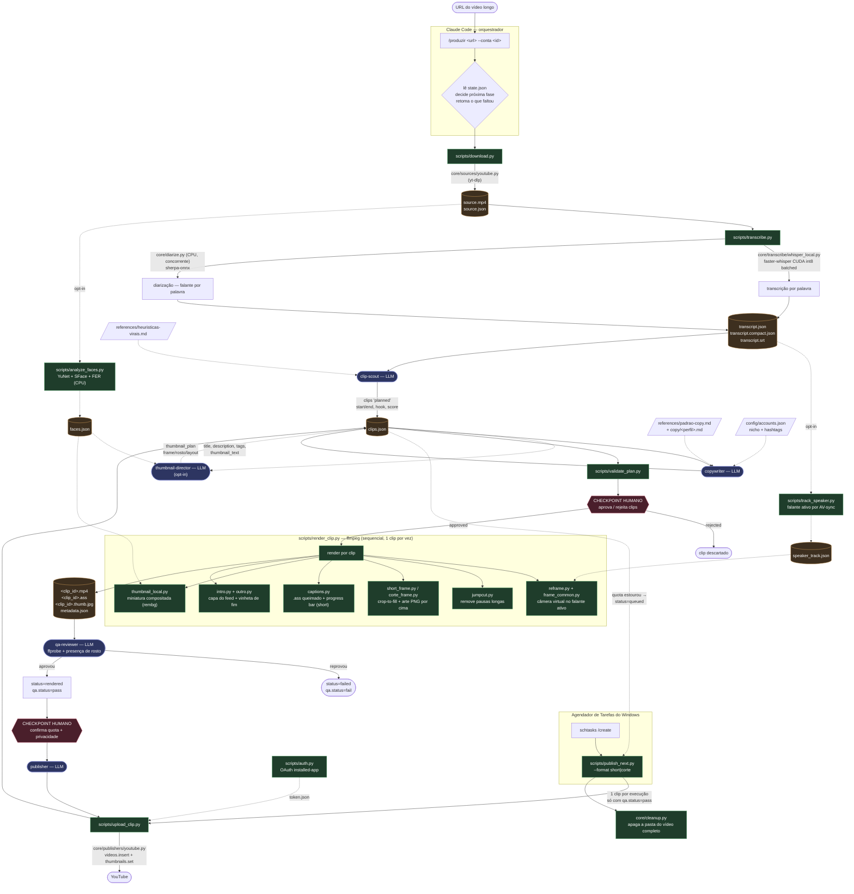
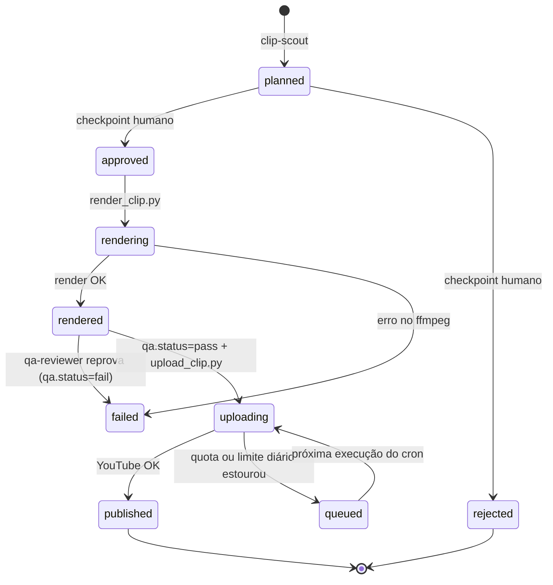

# cut-machine

Pipeline de produção de **cortes virais** (Shorts 9:16 e cortes 16:9) para YouTube, orquestrado pelo
**Claude Code**. Recebe a URL de um vídeo longo, transcreve com timestamps por palavra, deixa a LLM
escolher os melhores momentos, escreve título/descrição/tags, renderiza os cortes com arte de marca,
legendas queimadas e reenquadramento dinâmico, valida tecnicamente e publica — com retomada
automática de qualquer etapa interrompida.

> **Princípio central: LLM decide, script executa.** Subagentes (LLM) fazem a análise criativa
> (seleção de momentos, timestamps finos, copy, QA, thumbnail). Scripts Python determinísticos fazem
> o trabalho pesado (download, transcrição, visão computacional, ffmpeg, OAuth, upload). A LLM
> **nunca** toca em tokens ou secrets.

---

## Status do projeto — leia antes de usar

Este repositório é um laboratório pessoal, não um produto pronto para publicar em escala. Dois
pontos que qualquer pessoa deve conhecer antes de rodar:

1. **Os canais operados por este pipeline foram banidos pelo YouTube** (spam / práticas enganosas).
   As causas mapeadas: a camada `transform` (evasão de detecção por speed/pitch/EQ/flip/música),
   recorte de conteúdo de terceiros sem transformação substantiva, produção em massa e rede
   coordenada de canais irmãos. O reprojeto está documentado em
   [`docs/PIVOT-COMENTARIOS.md`](docs/PIVOT-COMENTARIOS.md): remover o `transform`, trocar o recorte
   puro por **comentário original** (mascote + TTS) e abandonar a operação em massa.
2. **A camada `transform` continua no código** (opt-in, desligada quando o bloco está ausente do
   `config/accounts.json`) porque o pivô ainda está em andamento. Ela **viola a política de spam do
   YouTube** — está documentada aqui como registro técnico, não como recomendação.

**Direitos autorais:** crédito não é licença. Use com vídeo próprio ou com licença explícita
(Creative Commons). O pipeline não resolve Content ID nem strike de copyright.

---

## Sumário

- [Visão geral](#visão-geral)
- [Arquitetura (fluxograma)](#arquitetura-fluxograma)
- [Fluxo detalhado: da URL à postagem](#fluxo-detalhado-da-url-à-postagem)
- [Formatos de saída](#formatos-de-saída)
- [Recursos opt-in por conta](#recursos-opt-in-por-conta)
- [Máquina de estados](#máquina-de-estados)
- [Módulos](#módulos)
- [Multi-conta e multi-plataforma](#multi-conta-e-multi-plataforma)
- [Publicação em drip via Agendador de Tarefas](#publicação-em-drip-via-agendador-de-tarefas)
- [Comandos](#comandos)
- [Instalação](#instalação)
- [Estrutura de diretórios](#estrutura-de-diretórios)

---

## Visão geral

| Camada | O que é | Onde |
|---|---|---|
| **Orquestrador** | O Claude Code lê o estado, decide a próxima etapa, apresenta checkpoints e retoma. Nunca processa mídia. | [`CLAUDE.md`](CLAUDE.md) |
| **Skills** | Fluxos disparáveis por comando (`/produzir`, `/planejar`, `/renderizar`, `/publicar`, `/status`, `/setup`, `/adicionar-canal`). | [`.claude/skills/`](.claude/skills/) |
| **Subagentes (LLM)** | Análise criativa: `clip-scout` (momentos), `copywriter` (copy), `thumbnail-director` (miniatura), `qa-reviewer` (validação), `publisher` (upload). | [`.claude/agents/`](.claude/agents/) |
| **Scripts (determinístico)** | CLIs finos e idempotentes sobre o `core`. Cada um imprime **uma linha JSON** no stdout e atualiza o estado sozinho. | [`scripts/`](scripts/) |
| **Core** | Pacote Python: contratos, estado, fontes/destinos, render (ffmpeg), transcrição (Whisper), diarização, visão computacional. | [`core/`](core/) |
| **Referências** | Rubricas e specs que a LLM consome: heurísticas virais, padrão de copy, formatos, estilo de legenda, API do YouTube. | [`references/`](references/) |

O estado vive em disco: **`video-output/<video_id>/state.json`** (por fase) e **`clips.json`** (por
clip). Antes de qualquer etapa o orquestrador lê o estado — nunca refaz uma etapa `done` e retoma
`partial` só pelo delta.

**Contrato de script:** todo CLI em `scripts/` é idempotente (emite `{"ok": true, "skipped": true}`
se já foi feito), imprime **uma única linha JSON como último output** no stdout, atualiza o
`state.json` sozinho e usa UTF-8 em toda I/O. O orquestrador lê só essa última linha.

**Contrato de dados:** `clips.json` é o único canal entre subagentes e scripts — nenhum dado de clip
vive fora dele, e cada campo tem um dono exclusivo (ver `core/contracts.py`). Ninguém sobrescreve
campo de outro dono.

---

## Arquitetura (fluxograma)



**Legenda das cores:** azul = subagente LLM · verde = script determinístico · laranja = artefato em
disco · vermelho = checkpoint humano. Linha tracejada = fase opt-in por conta.

---

## Fluxo detalhado: da URL à postagem

| # | Fase | Executor | Entrada → Saída |
|---|---|---|---|
| 1 | **download** | `scripts/download.py` → `core/sources/youtube.py` (yt-dlp) | URL → `source.mp4`, `source.json` |
| 2 | **transcribe** | `scripts/transcribe.py` → faster-whisper CUDA int8 batched + `core/diarize.py` (sherpa-onnx, CPU concorrente) | `source.mp4` → `transcript.json` (+ `.compact`, `.srt`), com falante por palavra |
| 3 | **faces** *(opt-in)* | `scripts/analyze_faces.py` → `core/faces/` (YuNet + SFace + FER, CPU) | amostra frames, agrupa identidades, marca o host → `faces.json` |
| 4 | **speaker-track** *(opt-in)* | `scripts/track_speaker.py` | correlaciona movimento da boca com a envolvente RMS do áudio dentro de cada turno de fala → `speaker_track.json` (falante ativo por frame) |
| 5 | **plan** | subagente **clip-scout** (LLM) | `transcript.compact.json` + `references/heuristicas-virais.md` → clips `planned` em `clips.json` (start/end, hook, score, `thumbnail_ts`) |
| 6 | **copy** | subagente **copywriter** (LLM) | clips `planned` + perfil de copy do nicho → `title`, `title_alts`, `description`, `tags`, `thumbnail_text` |
| 7 | **thumbnail** *(opt-in)* | subagente **thumbnail-director** (LLM) | `faces.json` + `thumbnail_text` → `thumbnail_plan` (frame, rosto, layout) |
| 8 | **checkpoint** | `scripts/validate_plan.py` + **humano** | valida a copy contra os contratos; apresenta a tabela; o humano aprova ou rejeita. Default: sugerir `score >= 70` |
| 9 | **render** | `scripts/render_clip.py` (ffmpeg, sequencial) | corta, reenquadra, remove pausas, compõe arte e legendas, gera miniatura, cola intro e vinheta → `<clip_id>.mp4`, `.ass`, `.thumb.jpg`, `metadata.json` |
| 10 | **qa** | subagente **qa-reviewer** (LLM orquestrando ffprobe) | resolução exata, duração ±0,5 s, faixa de áudio e presença de rosto → carimba `qa.status: pass` ou marca `failed` |
| 11 | **publish** | subagente **publisher** (LLM) → `scripts/upload_clip.py` | após aprovação humana e checkpoint de quota → `videos.insert` + `thumbnails.set`, registra `publish.*` |
| 12 | **cleanup** | `core/cleanup.py` (automático no fim do publish) | vídeo completo (≥1 clip `published`, nenhum pendente) → arquiva o `clips.json` em `video-output/_archive/` e apaga a pasta para liberar disco |

A **trava de QA** fecha a corrida entre render, QA e publish: `publish_next.py` só publica clip com
`qa.status == "pass"`. Clip `rendered` sem QA fica retido na fila. Retrofit determinístico dos mesmos
checks: `python scripts/qa_backfill.py`.

---

## Formatos de saída

Definidos em `core/contracts.py` → `FORMAT_RULES` (fonte única).

| | **short** | **corte** |
|---|---|---|
| Duração do conteúdo | 30–165 s (alvo ~60 s; reserva ~15 s para intro e vinheta, final ≤ 180 s, teto do Shorts) | 480–600 s (8–10 min; ≥ 8 min habilita mid-roll) |
| Resolução | 1080×1920 | 1920×1080 |
| Enquadramento | crop-to-fill (o vídeo cobre a janela, o excesso lateral é cortado) | crop-to-fill na janela da arte |
| Legendas queimadas | sim (ASS, cor por falante, pop-in) | não |
| Progress bar | sim | não |
| Miniatura | 1080×1920 | 1280×720 |

**Compositing (ambos):** canvas preto → vídeo na janela (ou os cortes de câmera do reframe) → arte
PNG da conta por cima → no short, progress bar e legendas queimadas por último. Toda a marca e o CTA
vêm embutidos no PNG; sem PNG, o corte cai numa moldura gerada preto+amarelo (`branding.py`).

**Duração esperada do mp4 final** = conteúdo + `intro_duration_s` + `outro_duration_s`
(`contracts.expected_output_duration`, base dos checks do QA).

---

## Recursos opt-in por conta

Cada recurso abaixo liga por um bloco em `config/accounts.json`. Bloco ausente = recurso desligado =
comportamento clássico, sem regressão.

| Bloco | Módulo | O que faz |
|---|---|---|
| `reframe` | `core/render/reframe.py` + `core/faces/speaker_track.py` | Câmera virtual que segue quem está falando, no lugar do crop central estático. Corte seco só na troca real de falante; dentro do plano a janela desliza suave (SmoothDamp). Com 2 ou mais rostos estáveis, enquadra o grupo **se todos couberem**; se não couberem, foca no busto do falante ativo. Sub-recursos: `cutaway` (corta para quem ouve nas pausas), `hook_punch` (zoom no gancho), `sfx_dir` (stinger na troca de plano). Requer a fase `speaker-track`. |
| `thumbnail` | `core/render/thumbnail_local.py` | `face_aware` monta a miniatura 100% local: fundo = frame real desfocado, sujeito = recorte rembg do host com glow, texto pelo motor ASS. `intro_short` cola a thumb como ~1 s congelado no início do short (o feed do Shorts usa o primeiro frame como capa). Fallback em cascata para a thumb ASS simples. Requer a fase `faces`. |
| `jumpcut` | `core/render/jumpcut.py` | Remove pausas longas entre palavras (gaps do transcript) com um respiro em cada ponta. **Única fase que muda a duração do clip** — roda por último e isolada; as legendas são remapeadas por `timemap.py`. |
| `brand.short_outro` / `brand.corte_outro` | `core/render/outro.py` | Vinheta de fim por conta. Normaliza a arte (fit+pad, 30 fps, yuv420p, áudio 48k AAC) e concatena depois do check de duração do conteúdo. Falha aqui é fatal. |
| `transform` | `core/render/transform.py` | **Camada anti-detecção — viola a política de spam do YouTube** (ver [Status do projeto](#status-do-projeto--leia-antes-de-usar)). Speed, pitch, EQ, ruído, música de fundo com duck reverso, grade de cor, zoom e flip, com valor sorteado por clip de forma determinística (seed = `clip_id`). Mantida no repositório como registro técnico; o pivô remove a camada. |

---

## Máquina de estados

**Por fase** (`state.json`): `pending → running → done`, com `partial` (retoma pelo delta) e
`failed`. Um `running` órfão (o processo morreu) é reclassificado verificando o artefato com
`ffprobe` — nunca se marca `done` sem artefato verificado.

**Por clip** (`clips.json.clips[].status`):



Desvios (`rejected` / `failed`) sempre carregam um campo `error` obrigatório. Falha de um clip **não
derruba os demais** — marca-se o clip e o loop continua.

---

## Módulos

### `core/` — pacote Python

| Módulo | Responsabilidade |
|---|---|
| `paths.py` | Resolução de todos os caminhos (`video-output/<id>/...`). |
| `state.py` | Leitura e escrita atômica do `state.json` (estado por fase). |
| `contracts.py` | **Fonte da verdade dos dados**: `FORMAT_RULES`, `CLIP_STATUSES`, `validate_plan`, `lint_copy`, donos por campo do `clips.json`. |
| `cli.py` | `emit()` — imprime a linha JSON canônica que o orquestrador lê. |
| `accounts.py` | `get_account(platform, id)` — resolve conta, credenciais e identidade editorial. |
| `media.py` | Wrappers de ffprobe/ffmpeg (metadados, duração). |
| `cleanup.py` | Arquiva o `clips.json` e apaga a pasta dos vídeos completos (libera os GB de mp4/source/thumbs). |
| `diarize.py` | Diarização sherpa-onnx (CPU, sem torch e sem token): `spk` por palavra, cor por falante. |
| `sources/` | Abstração de **fonte**: `VideoSource.matches()/fetch()` + `get_source(url)`. Hoje `youtube.py`. |
| `transcribe/` | `whisper_local.py` — faster-whisper `large-v3` int8 com `BatchedInferencePipeline` e diarização concorrente. |
| `faces/` | `detector.py`/`analyze.py` (YuNet + SFace + FER), `cluster.py` (identidades), `speaker_track.py` (falante ativo por AV-sync), `presence.py` (check de rosto em quadro para o QA). |
| `render/` | `frame_common.py` (mecânica de encaixe), `short_frame.py`/`corte_frame.py` (compositing), `reframe.py` (câmera virtual), `jumpcut.py` + `timemap.py`, `captions.py` (.ass), `thumbnail_local.py`/`thumbnail.py`, `intro.py`/`outro.py`, `music_mood.py`/`sfx.py`, `transform.py`, `encoder.py` (NVENC/libx264), `ffmpeg.py` (grafo de filtros). |
| `publishers/` | Abstração de **destino**: `Publisher.authenticate()/upload()` + `get_publisher(platform)`. Hoje `youtube.py` + `upload_log.py` (controle de quota). |

> **Extensibilidade:** nova plataforma = nova classe `VideoSource`/`Publisher` + registro no
> `__init__.py`. O schema do `clips.json` **não muda** (`publish.platform` já é parametrizado).

### `scripts/` — CLIs determinísticos

| Script | O que faz |
|---|---|
| `download.py` | Baixa o vídeo e os metadados (yt-dlp). |
| `transcribe.py` | Transcreve com timestamps por palavra e diariza. |
| `diarize.py` | Retrofit ou re-diarização de um transcript existente (`--speakers N`). |
| `analyze_faces.py` | Fase `faces`: detecção, agrupamento de identidades e host (`faces.json`). |
| `track_speaker.py` | Fase `speaker-track`: falante ativo por frame (`speaker_track.json`). |
| `render_clip.py` | Render completo do clip (ffmpeg): corte, reframe, jump-cut, arte, legendas, miniatura, intro e vinheta. |
| `validate_plan.py` | Valida o plano contra os contratos (checkpoint pré-render). |
| `qa_backfill.py` | Carimba `qa.*` em massa com os mesmos checks via ffprobe (rede de segurança). |
| `upload_clip.py` | OAuth + `videos.insert` + `thumbnails.set`. |
| `publish_next.py` | Publica **o próximo clip pendente** (um por execução) — feito para o Agendador. |
| `cleanup_published.py` | Retrofit da limpeza de disco (`--dry-run` disponível). |
| `classify_music.py` | Classifica as faixas do pool em `agressiva`/`neutra`/`calma` por análise de áudio. |
| `auth.py` | Fluxo OAuth installed-app (gera `token.json`). |
| `smoke_frame.py` | Smoke test do compositing de moldura. |

### `.claude/agents/` — subagentes LLM

`clip-scout` (seleção de momentos) · `copywriter` (copy) · `thumbnail-director` (miniatura, opt-in) ·
`qa-reviewer` (validação técnica via ffprobe) · `publisher` (upload e relatório).

### `.claude/skills/` — comandos

`setup` · `produzir` · `planejar` · `renderizar` · `publicar` · `status` · `adicionar-canal`.

---

## Multi-conta e multi-plataforma

As contas ficam em [`config/accounts.json`](config/accounts.json); credenciais e tokens ficam **fora
do git**, em `secrets/<plataforma>/<conta>/`. Cada conta define a identidade editorial
(`channel_name`, `niche`, `copy_profile`, `default_hashtags`), a arte de marca e quais recursos
opt-in liga.

O copywriter lê o padrão universal (`references/padrao-copy.md`) **mais** o perfil do nicho
(`references/copy/<copy_profile>.md`, com arquétipos, exemplos, hashtags e avisos legais do nicho).

> **A conta é sempre explícita.** `/produzir` e `/planejar` exigem `--conta <id>`; sem a flag, o
> orquestrador para e pergunta. Assumir a conta errada mistura os canais (arte do render, nicho da
> copy e canal do upload) e é difícil de desfazer.

---

## Publicação em drip via Agendador de Tarefas

Para pingar clips ao longo do dia, em vez de um lote só, `scripts/publish_next.py` publica **um único
clip por execução** — escolhe o próximo pendente (`rendered` com `qa.status == "pass"`, ou `queued`),
em round-robin entre vídeos e por score decrescente. É idempotente e seguro para sobre-disparo: se a
quota ou o limite diário estourou, o clip volta para `queued` sem gastar unidade e é tentado de novo
na execução seguinte.

```powershell
# 3x ao dia, formato short; sempre via scripts/run_hidden.vbs (WScript.Shell.Run
# com WindowStyle=0) — sem ele o Agendador abre uma janela de cmd visível a cada
# disparo (LogonType=InteractiveToken roda na sessão interativa do usuário logado).
schtasks /create /tn "cut-machine\drip-short" /sc daily /st 09:00 /ri 240 /du 12:00 ^
  /tr "wscript.exe //B \"C:\caminho\do\projeto\scripts\run_hidden.vbs\" \"C:\caminho\do\projeto\scripts\publish_short.cmd\""

# um corte por dia às 18h
schtasks /create /tn "cut-machine\drip-corte" /sc daily /st 18:00 ^
  /tr "wscript.exe //B \"C:\caminho\do\projeto\scripts\run_hidden.vbs\" \"C:\caminho\do\projeto\scripts\publish_corte.cmd\""
```

Para mudar o `/tr` de uma tarefa existente, não use `schtasks /change /tr` — ele pede a senha do
usuário toda vez, mesmo em logon interativo sem senha salva. Exporte com
`schtasks /query /tn "<nome>" /xml`, edite só `<Command>`/`<Arguments>` e reimporte com
`schtasks /create /xml <arquivo> /tn "<nome>" /f` (preserva `LogonType` e a agenda, sem prompt).

Confira o que seria publicado, sem gastar quota:

```bash
python scripts/publish_next.py --format short --dry-run
```

**Quota do YouTube:** dois contadores separados — **100 uploads/dia** (teto real) e **10 000
queries/dia** (`videos.insert` = 1600, `thumbnails.set` = 50; o upload **não** drena as 10k a
1600 por unidade). O token OAuth em modo *Testing* expira em **7 dias**; re-autentique com
`scripts/auth.py`.

---

## Comandos

Dentro do Claude Code (skills):

```
/setup                                          # instala deps + walkthrough GCP/OAuth
/adicionar-canal                                # onboarding de uma nova conta/canal
/produzir <url> --conta <id> [--sem-upload]     # pipeline completo com retomada
/planejar <video_id> --conta <id>               # só plan + copy + checkpoint
/renderizar <video_id> [clip_id]                # só render + qa
/publicar <video_id> [clip_id] [--conta <id>]   # só publish (com checkpoint de quota)
/status [video_id]                              # tabela consolidada de fases e clips
```

CLIs diretas:

```bash
python scripts/download.py      --url <URL>
python scripts/transcribe.py    --video-id <id> [--model large-v3] [--device auto|cuda|cpu] [--compute int8] [--batch-size 4] [--no-diarize] [--speakers N]
python scripts/diarize.py       --video-id <id> [--speakers N] [--force]
python scripts/analyze_faces.py --video-id <id> [--account <id>] [--interval 2.0] [--max-frames 2500] [--force]
python scripts/track_speaker.py --video-id <id> [--account <id>] [--fps 5.0] [--max-frames 4000] [--force]
python scripts/render_clip.py   --video-id <id> [--clip <clip_id>] [--all-approved]
python scripts/qa_backfill.py   [--video-id <id>] [--force]
python scripts/upload_clip.py   --video-id <id> --clip <clip_id> [--platform youtube] [--account <id>]
python scripts/publish_next.py  --format short|corte [--account <id>] [--dry-run]
python scripts/cleanup_published.py [--video-id <id>] [--dry-run]
python scripts/auth.py          --platform youtube [--account <id>]
```

O render é **sequencial** por clip — uma GPU de 6 GB não comporta paralelismo folgado.

---

## Instalação

Requisitos: **Python 3.10+**, **ffmpeg** no PATH e, para transcrição acelerada, uma **GPU NVIDIA**.
O projeto foi calibrado numa GTX 1660 SUPER 6 GB, que exige `compute_type=int8` e **nunca fp16** (a
série 16xx retorna NaN em fp16). Diarização, visão computacional e o fallback de transcrição rodam
em CPU.

```bash
pip install -r requirements.txt   # yt-dlp, faster-whisper, ctranslate2, sherpa-onnx, opencv, rembg, google-api-*
```

Ou use a skill guiada, que instala as dependências, roda os smoke tests (CUDA, filtro `ass`,
`compileall`) e conduz a criação do projeto GCP/OAuth:

```
/setup
```

Autentique uma conta antes do primeiro upload:

```bash
python scripts/auth.py --platform youtube --account <id>
```

O encode usa `h264_nvenc` quando disponível (`RENDER_ENCODER=auto|nvenc|libx264` sobrescreve, com
probe cacheado e fallback automático para `libx264`). Os modelos ONNX de diarização e de rosto são
baixados sob demanda no primeiro uso, em `models/`.

---

## Estrutura de diretórios

```
CLAUDE.md                      # instruções do orquestrador (fonte de verdade operacional)
config/accounts.json           # contas por plataforma + identidade editorial + recursos opt-in
.claude/agents/                # clip-scout, copywriter, thumbnail-director, qa-reviewer, publisher
.claude/skills/                # setup, adicionar-canal, produzir, planejar, renderizar, publicar, status
references/                    # heuristicas-virais, padrao-copy, copy/<nicho>, formatos-redes, estilo-legendas, youtube-api
docs/                          # ARQUITETURA.md, PLAN.md, PIVOT-COMENTARIOS.md
core/                          # pacote Python (contratos, estado, sources, faces, render, transcribe, publishers)
scripts/                       # CLIs finos e idempotentes sobre o core
assets/                        # arte por conta: short-frame/, corte-frame/, short-end/, corte-end/ + music/ (pool compartilhado)

# gerados / fora do git (.gitignore):
video-output/<video_id>/       # state.json, source.*, transcript.*, faces.json, speaker_track.json, clips.json, <clip_id>/...
video-output/_archive/         # clips.json arquivado dos vídeos já limpos do disco
models/                        # modelos ONNX (diarização, rosto) baixados sob demanda
secrets/<plataforma>/<conta>/  # credentials.json, token.json, upload_log.json
```

---

## Docs de referência

- [`docs/ARQUITETURA.md`](docs/ARQUITETURA.md) — verdade técnica: interfaces e decisões fixas (Whisper int8, yt-dlp, ffmpeg, ASS, quota).
- [`docs/PLAN.md`](docs/PLAN.md) — plano de implementação e progresso.
- [`docs/PIVOT-COMENTARIOS.md`](docs/PIVOT-COMENTARIOS.md) — reprojeto pós-banimento: comentário original, mascote com TTS, remoção do `transform`.
- [`references/heuristicas-virais.md`](references/heuristicas-virais.md) — rubrica de score e padrões de hook.
- [`references/padrao-copy.md`](references/padrao-copy.md) — padrão editorial de título, descrição e tags.
- [`references/formatos-redes.md`](references/formatos-redes.md) — limites por plataforma e zonas seguras.
- [`references/estilo-legendas.md`](references/estilo-legendas.md) — spec das legendas ASS queimadas.
- [`references/youtube-api.md`](references/youtube-api.md) — GCP, OAuth, quota, `videos.insert`.

---

## Licença

Sem licença declarada. Uso pessoal e educacional; respeite os direitos autorais do material de
origem e os termos de serviço das plataformas envolvidas.
